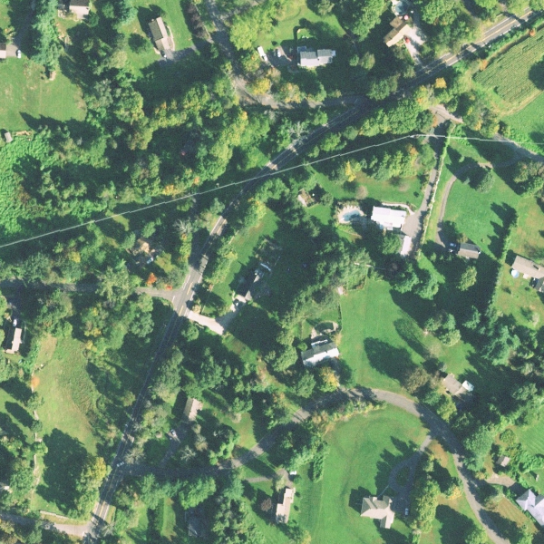
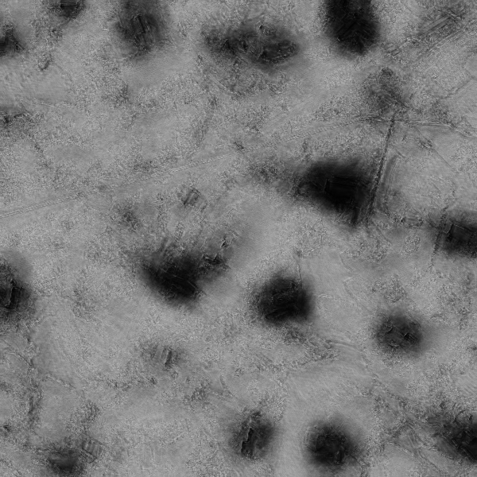

# Seasonally Invariant Deep Transform for Visual Terrain-Relative Navigation
This is the official training code for the models presented in the **Science Robotics** paper: [*A seasonally invariant deep transform for visual terrain-relative navigation*](https://www.science.org/stoken/author-tokens/ST-66/full) 
<div style="text-align: center;">
    
    
</div>

## Example Usage
We will work with a toy dataset of raw orthorectified image pairs stored in `data/coregistered_images`.

### Environment setup
Create a python3 anaconda environment and use the `requirements.txt` file provided. Install any still-missing packages as needed. 
```
pip3 install -r requirements.txt
```

### Processing large orthorectified data
To create the training dataset, run 
```
python createTiledDataset_v2.py --raw_data_dir=data/coregistered_images/off --save_data_dir=data/training_pairs/off --overlap_ratio=0 --crop_width=600 --crop_height 600

python createTiledDataset_v2.py --raw_data_dir=data/coregistered_images/on --save_data_dir=data/training_pairs/on --overlap_ratio=0 --crop_width=600 --crop_height 600
```

### Training a deep transform for NCC-based registration
To train a deep image transform to optimize downstream image registration based on normalized cross-correlation (NCC), run
```
### Just as an example, use training dataset for validation

python siamese-ncc.py --exp_name=correlation-toy-example --training_data_dir=data/training_pairs/ --validation_data_dir=data/training_pairs/ --batch-size=4 --epochs=100 --device=0 --num_workers=4
```
Perform inference using the learned weights on a sample image via
```
python siamese-inference.py --data_dir data/samples/fakeplaceid_fakequad_000015_on.png --output_dir correlation-toy-example/sample-outputs --weights_path correlation-toy-example/weights/best_test_weights.pt
```

<div float="left">
    
    
</div>

### Training a deep transform for SIFT-based registration
To optimize the image transform for a feature matching registration objective, run
```
python siamese-sift.py --exp_name sift-example --training_data_dir=data/training_pairs/ --validation_data_dir=data/training_pairs/ --subsamples=100 --crop_width=64 --batch-size=2 --zeta=10 --gamma=1 --epochs=100
```

## Notes
- Training a NCC-optimized image transform should not be difficult. 
- The feature-based transform is harder to train, and may require some hyperparameter tuning and loss balancing depending on your dataset (tip: start with just the detector loss and add in descriptor loss in small amounts if needed).   
- For both transforms, the appearance of the transformed images may vary, depending on the characteristics (size, terrain variety, etc...) of the dataset used during training. 

## Working with a custom dataset

### Create the dataset
Store your coregistered dataset under a directory structure like so
```
RAW_DATA_ROOT/
    on/
        image1.png
        image2.png
        ...
        imageN.png
    off/
        image1.png
        image2.png
        ...
        imageN.png
```
If the images are very large, then process then into smaller crops via `createTiledDataset.py`. 

## Citation
If you find our code or paper useful, please consider citing our paper:
```
@article{fragoso2021seasonally,
  title={A seasonally invariant deep transform for visual terrain-relative navigation},
  author={Fragoso, Anthony T and Lee, Connor T and McCoy, Austin S and Chung, Soon-Jo},
  journal={Science Robotics},
  volume={6},
  number={55},
  pages={eabf3320},
  year={2021},
  publisher={American Association for the Advancement of Science}
}
```

## Acknowledgements
Our U-Net code is based on [Pytorch-UNet](https://github.com/milesial/Pytorch-UNet).
